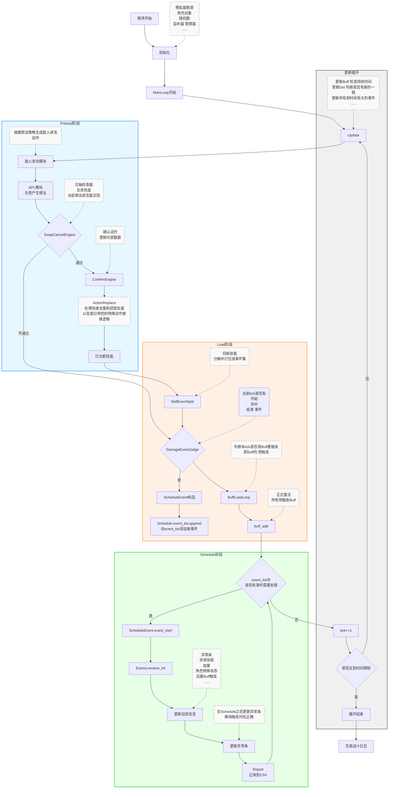

```mermaid
flowchart TD
    A[程序开始] --> B[初始化]
    NoteB(模拟器框架\n角色对象\n随机数\n监听器 管理器\n......) -.-> B
    B --> C[MainLoop开始]
    C --> U[Update]
    NoteU(更新Buff 检查持续时间\n更新Dot 判断是否有新的一跳\n更新所有和时间有关的事件\n......) -.-> U
    U --> D
    subgraph Preload[Preload阶段]
        D[敌人进攻模块] --> E[APL模块\n负责产生想法]
        NoteD(根据预设策略生成敌人进攻动作) -.-> D
        E --> F{SwapCancelEngine}
        NoteF(合轴检查器\n负责检查\n当前想法是否能实现) -.-> F
        F -->|通过| G[ConfirmEngine]
        NoteG(确认动作\n更新内部数据) -.-> G
        G --> NoteActionReplace[打出新技能]
        NoteActionReplace(ActionReplace\n处理快速支援和招架支援\n以及部分角色的特殊动作替换逻辑) --> G_1
    end
    subgraph Load[Load阶段]
        F -->|不通过| I[驳回]
        G_1[打出新技能] --> H[SkillEventSplit]
        NoteH(将新技能\n分解并打包成事件集) -.-> H
        H --> I{DamageEventJudge}
        NoteI(当前tick是否有\n开始\n命中\n结束 事件) -.-> I
        I -->|是| L[ScheduleEvent构造]
        L --> M_1[Schedule.event_list.append\n向event_list添加新事件]
        I --> J[BuffLoadLoop]
        NoteJ(判断本tick是否有Buff要触发\n即Buff的 预触发) -.-> J
        J --> K[buff_add]
        NoteK(正式激活\n所有预触发Buff) -.-> K
    end
    subgraph Schedule[Schedule阶段]
        K --> L_1{event_list中\n是否有事件需要处理}
        L_1 -->|是| M[ScheduleEvent.event_start]
        M --> S[Enemy.receive_hit]
        S --> T[更新动态信息]
        NoteT(异常条\n异常快照\n血量\n角色特殊状态\n后置Buff触发\n......) -.-> T
        T --> U_1[更新异常条]
        NoteU1(在Schedule之后更新异常条\n确保触发时机正确) -.-> U_1
        U_1 --> Z[Report\n记录到CSV]
        Z --> L_1
    end
    subgraph UpdateLoop[更新循环]
        L_1 -->|否| O[tick+=1]
        O --> P{是否达到时间限制}
        P -->|是| Q[循环结束]
        P -->|否| U
        NoteU
    end
    Q --> R[生成战斗日志]
    %% 样式定义
    classDef preload fill:#e6f7ff,stroke:#3399ff,stroke-width:2px;
    classDef load fill:#fff0e6,stroke:#ff9933,stroke-width:2px;
    classDef schedule fill:#e6ffe6,stroke:#33cc33,stroke-width:2px;
    classDef update fill:#f0f0f0,stroke:#666666,stroke-width:2px;
    classDef note fill:#f9f9f9,stroke-dasharray: 5 5,stroke:#666,color:#333;
    class Preload preload;
    class Load load;
    class Schedule schedule;
    class UpdateLoop update;
    class NoteB,NoteU,NoteD,NoteF,NoteG,NoteH,NoteJ,NoteK,NoteT,NoteActionReplace note;
    class NoteU1 note;
```
